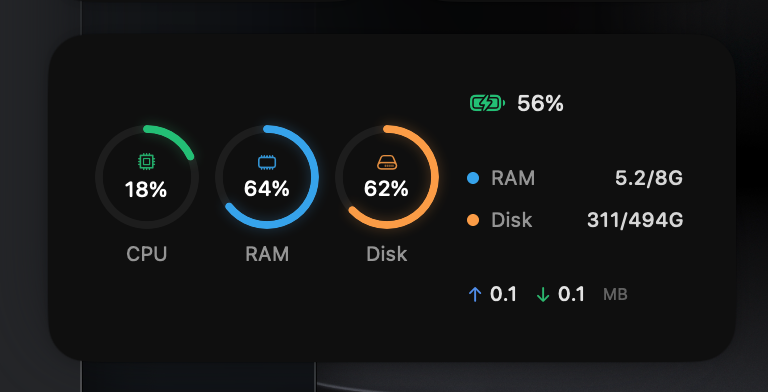

# Pulse

A beautiful macOS System Monitor Widget for Notification Center. Monitor your Mac's performance at a glance with Apple Watch-inspired activity rings.

## Features

- **Real-time Monitoring** - CPU, RAM, Disk, Battery & Network stats updated every 15 seconds
- **Activity Ring Design** - Apple Watch-inspired circular progress indicators
- **Distinct Colors** - Each metric has its own color for quick identification:
  - 🟢 CPU - Green
  - 🔵 RAM - Blue
  - 🟠 Disk - Amber
- **Battery Indicator** - Color-coded battery status (Green ≥50%, Amber 21-49%, Red ≤20%)
- **Network Speed** - Upload and download speeds in MB/s
- **Multiple Sizes** - Small, Medium, and Large widget options
- **Apple HIG Compliant** - Native macOS design language

## Screenshot



## Requirements

- macOS 14.0 (Sonoma) or later
- Xcode 15.0 or later (for building)

## Installation

### From Source

1. Clone the repository:
   ```bash
   git clone https://github.com/FELMONON/Pulse.git
   cd Pulse
   ```

2. Open in Xcode:
   ```bash
   open MacMonitorWidget.xcodeproj
   ```

3. Build and run (⌘R)

4. Add widget to Notification Center:
   - Click the date in your menu bar
   - Click "Edit Widgets"
   - Search for "Pulse"
   - Drag to add

## Widget Sizes

### Small Widget
- Battery status
- CPU & RAM activity rings
- Network speed

### Medium Widget
- CPU, RAM & Disk activity rings
- Battery status
- RAM & Disk usage details
- Network speed

### Large Widget
- All activity rings
- Detailed memory & storage stats
- Network activity
- Running apps list

## Tech Stack

- SwiftUI
- WidgetKit
- IOKit (for system stats)
- AppKit

## License

MIT License

## Author

Built with Claude Code
