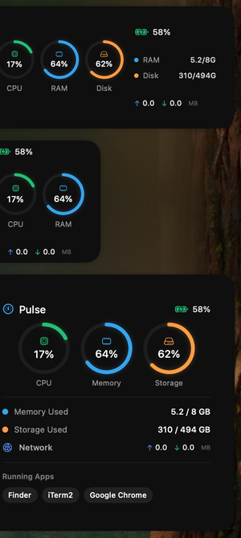

# Pulse

> A minimal, beautiful macOS System Monitor Widget for Notification Center



## Features

**Activity Ring Design** — Apple Watch-inspired circular progress indicators with distinct colors:

| Metric | Color | Description |
|--------|-------|-------------|
| CPU | 🟢 Green | Processor usage |
| RAM | 🔵 Blue | Memory usage |
| Disk | 🟠 Amber | Storage usage |

**Smart Battery Indicator** — Color-coded status that changes based on level:
- Green (≥50%) — Healthy
- Amber (21-49%) — Moderate
- Red (≤20%) — Low

**Network Monitor** — Real-time upload/download speeds in MB/s

**Three Widget Sizes** — Small, Medium, and Large options for Notification Center

## Requirements

- macOS 14.0 Sonoma or later
- Xcode 15.0+ (for building from source)

## Installation

**Clone & Build:**

```bash
git clone https://github.com/FELMONON/Pulse.git
cd Pulse
open Pulse.xcodeproj
```

Then press `⌘R` to build and run.

**Add to Notification Center:**

1. Click the date/time in your menu bar
2. Scroll down and click **Edit Widgets**
3. Search for **Pulse**
4. Drag your preferred size to the sidebar

## Tech Stack

- SwiftUI + WidgetKit
- IOKit for system metrics
- AppKit for app detection

## License

MIT

---

*Built with [Claude Code](https://claude.ai/code)*
